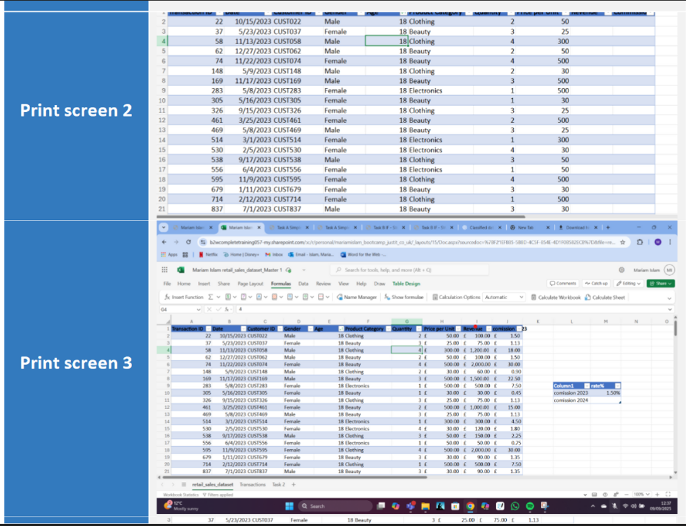

# Week 1 – Introduction to Data and Excel

## Overview
In the first week, I learned the basics of data analysis and how to organise, format, and interpret data using Microsoft Excel. I explored essential functions, formulas, and tools for cleaning and analysing datasets, gaining a better understanding of how Excel supports accurate and efficient data handling.

# 📊 Excel Data Analysis & Compliance Skills

This section highlights my experience using advanced Excel tools and data protection principles to manage, analyse, and present large datasets effectively.

---

## 🧠 Key Skills

- 🔹 Utilised **Advanced Excel Formulas** to clean, organise, and analyse large datasets efficiently.  
- 🔹 Applied **VLOOKUP** and **XLOOKUP** to retrieve, compare, and integrate data across multiple worksheets.  
- 🔹 Created **PivotTables** and used the **SWITCH** function to group, categorise, and interpret results.  
- 🔹 Developed and implemented **Macros** to automate repetitive data analysis tasks, improving workflow efficiency.  
- 🔹 Ensured full compliance with **GDPR** and the **Data Protection Act 2018** in all data handling processes.  

---

## 💡 Summary

Through practical application of Excel and data governance principles, I’ve developed strong analytical and problem-solving skills that support accurate, ethical, and efficient data-driven decision-making.
