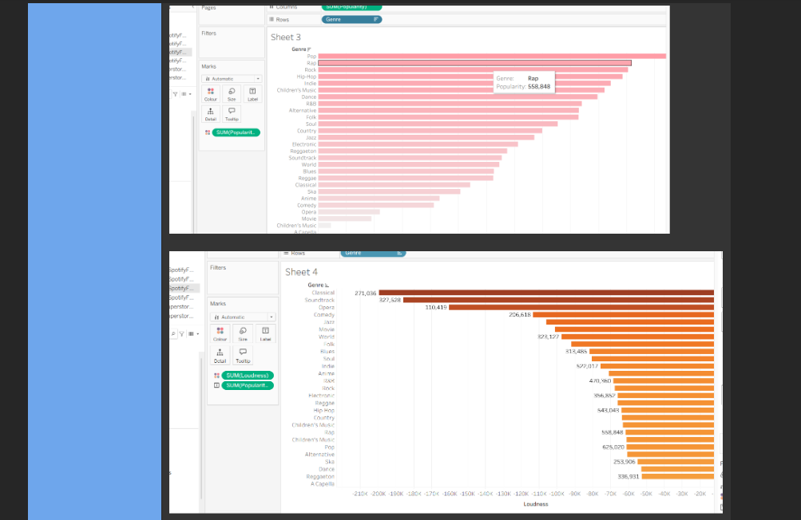

# 📊 Week 2: Data Visualisation with Tables, Tableau & Power BI

## Overview
In the second week, I was introduced to data visualisation and learned how to present data clearly and effectively using tools like Tableau and Power BI. I explored how to create interactive dashboards, charts, and graphs to communicate insights, making data easier to understand and more meaningful for decision-making.

---

## 🧠 Key Skills

- 🔹 Designed and formatted **data tables** to highlight key trends and comparisons.  
- 🔹 Created **interactive dashboards** and **data visualisations** using **Tableau** and **Power BI**.  
- 🔹 Applied **charts, graphs, and filters** to effectively communicate data patterns and insights.  
- 🔹 Used **colour theory and layout principles** to enhance readability and audience engagement.  
- 🔹 Interpreted visual data to support evidence-based conclusions and presentations.  

---

## 💡 Summary

By learning how to present data visually, I gained the ability to turn complex datasets into accessible, engaging, and insightful stories — an essential skill for clear communication in data analysis.
