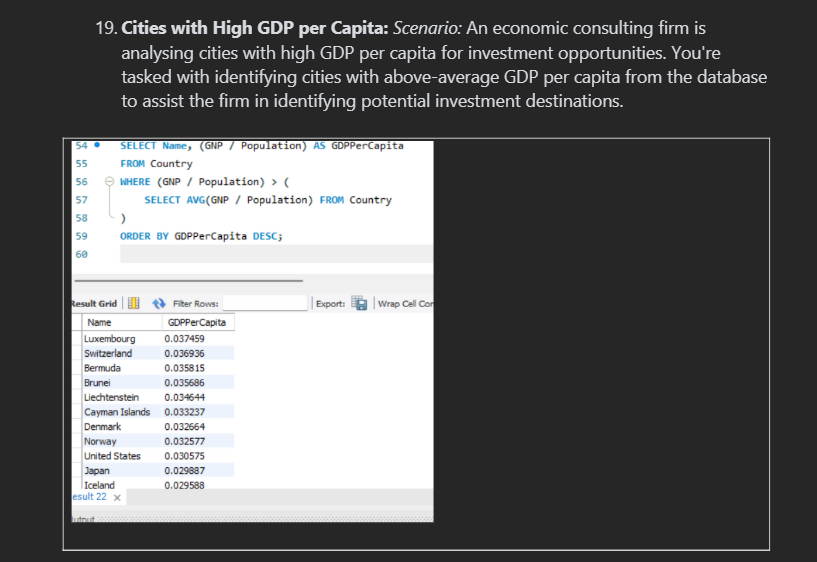

# 🗂️ Week 3: Introduction to Databases & SQL

## Overview
In the third week, I learned about databases and how they are used to store and manage large amounts of data efficiently. I was introduced to SQL (Structured Query Language) and practised writing basic queries to retrieve, filter, and organise data. This helped me understand how databases support structured data analysis and decision-making.

---

## 🧠 Key Skills

- 🔹 Gained an understanding of **database structures**, including **tables**, **records**, and **relationships**.  
- 🔹 Learned to write **SQL queries** to extract, filter, and sort information from databases.  
- 🔹 Used **SELECT**, **WHERE**, **ORDER BY**, and **LIMIT** statements to control data output.  
- 🔹 Applied **aggregate functions** such as **COUNT**, **AVG**, **MIN**, and **MAX** to summarise datasets.  
- 🔹 Explored **primary keys**, **foreign keys**, and **joins** to link and organise data across multiple tables.  

---

## 💡 Summary

This module strengthened my ability to handle structured data and perform precise data extraction, laying the groundwork for advanced data analysis and database management.
